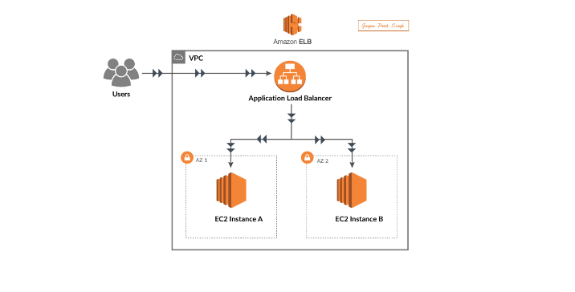

# Optimizing Web App High Availability with AWS ALB and EC2 ⚖️

## 📌 Project Overview
This repository contains the architecture and implementation details for a highly available, fault-tolerant two-tier web application architecture. The project demonstrates how an AWS Application Load Balancer (ALB) operating at Layer 7 of the OSI model efficiently routes client traffic across decoupled EC2 compute nodes situated across distinct Availability Zones (AZs).

---

## 🗺️ Network Architecture Diagram
Below is the deployment topology engineered to prevent single points of failure and eliminate bottleneck vectors:

<div align="center">
  
</div>

---

## 📚 Detailed Step-by-Step Documentation
For an exhaustive, hands-on walkthrough containing step-by-step configuration workflows, security group mappings, and server script executions, you can download or view the complete lab report directly:

📥 **[Click Here to Download the Full PDF Report](./Optimizing-Web-App-High-Availability-with-AWS-ALB-and-EC2.pdf?raw=true)**

*(Note: If GitHub's online preview fails to load natively inside the browser sidebar, utilize the download link above to open the full documentation locally.)*

---

## 🏗️ Architecture Design
The infrastructure is engineered to gracefully handle variable user traffic patterns:
* **Elastic Load Balancing:** An internet-facing AWS ALB handles incoming public HTTP requests.
* **Multi-AZ Compute:** Two EC2 instances (t2.micro running Amazon Linux) are deployed across separate Availability Zones (AZ-1 and AZ-2) to ensure high availability.
* **Target Group Optimization:** Traffic is mapped to target group `tg-01` over HTTP Port 80 using HTTP/1.1 protocols for optimized container/node communication.

## 🔒 Layered Security Architecture
To balance user accessibility with robust network hardening, the following security measures were implemented:

### 1. Security Group Configuration
* **Inbound Rules:** Strictly isolated to minimize external attack surfaces.
  * **HTTP (Port 80):** Allowed from anywhere (`0.0.0.0/0`) to route public web traffic cleanly to the ALB.
  * **SSH (Port 22):** Restricted access enabled exclusively for secure remote server administration.
* **Outbound Rules:** Set to allow all destinations by default to permit necessary system updates (`yum update`) and external API dependencies.

### 2. Access Authentication
* Enforced **Public Key Authentication** via asymmetric key-pairs to eliminate password vulnerabilities.
* Confidential private keys are maintained client-side, while public keys are securely distributed into the native `authorized_keys` configurations on the EC2 instances.

## 🚀 Deployment & Automation Scripts
To configure the instances for web hosting automatically upon launch, an automated shell script was passed into the **EC2 User Data** payload during instance initialization:

```bash
#!/bin/bash
# Update core system packages
sudo yum update -y

# Install Apache Web Server
sudo yum install httpd -y

# Start and enable the Apache service to run at boot
sudo systemctl start httpd
sudo systemctl enable httpd

# Create a Simple Web Page to identify the instance behind the ALB
echo "Hello from EC2 Instance 1" | sudo tee /var/www/html/index.html
